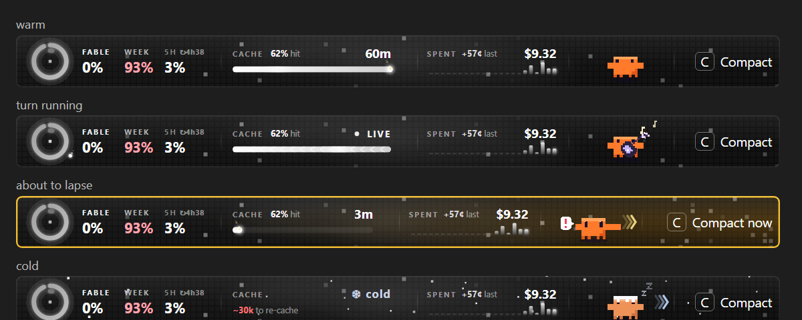
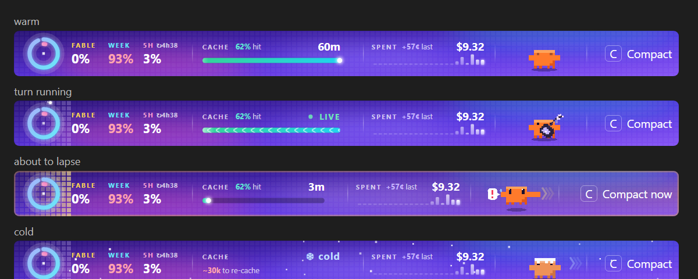

# Halo

A living banner above the Claude Code prompt in the Claude Desktop app. It shows how much of your usage limits you have used, how long your prompt cache stays warm, what the session has cost, and a Compact button, with a little pixel Claude keeping you company.





## What's on it

- **The dial.** Three rings, outside to inside: your Fable weekly limit, your weekly limit, and your 5-hour limit. Next to it, the same three as numbers, plus when the 5-hour window resets. A number turns yellow at 75% and pink at 90%.
- **Cache.** How much of the last request came from the prompt cache, and a fuse that burns down until the cache goes cold. Near the end it turns amber, then red. When it lapses the banner frosts over and it snows, and it tells you how many tokens your next message will re-cache.
- **Spent.** What this session has cost, what the last turn cost, and a small bar for each recent turn.
- **Claude.** Breathes, blinks and waves while idle, plays guitar while a turn runs, jumps and points at Compact when the cache is about to lapse, and falls asleep in the snow when it does.
- **Compact.** Always in the banner's right end (press `c` when the banner has focus). It turns into an orange "Compact now" when compacting pays off.
- **Next steps.** After each answer, three suggested follow-ups appear under the banner. Press 1 to 3 to fill the prompt, 0 to dismiss. This makes one small Haiku call per answer; `/halo next off` turns it off.

Everything between events animates inside the SVG itself, so the banner costs no tokens and needs no redraw timers.

## Install

You need the **Claude Desktop app** and a **local** Code session. Halo draws on a screen attached to the session, so a cloud session shows nothing, and a plain terminal gets a one-line text version.

1. Get the code somewhere permanent:

   ```bash
   git clone https://github.com/cosmic044/halo ~/.claude/mods/halo
   ```

2. Check it (both should pass, 6 tests):

   ```bash
   claude plugin validate ~/.claude/mods/halo
   claude plugin test ~/.claude/mods/halo
   ```

3. Point Claude Code at it in your user settings, `~/.claude/settings.json`, by adding an `env` entry with the folder's absolute path. Merge it into what is already there, don't replace the file:

   ```json
   { "env": { "CLAUDE_CODE_PLUGIN_DIRS": "/Users/you/.claude/mods/halo" } }
   ```

   On Windows: `"C:\\Users\\you\\.claude\\mods\\halo"`. If `CLAUDE_CODE_PLUGIN_DIRS` already has a path, add this one after it, separated by `:` on macOS and Linux or `;` on Windows.

4. Start a **new** local Code session in the Desktop app. Halo appears above the prompt after the first reply.

### Or let Claude do it

Paste this into a local Claude Code session:

> Install the Halo mod for Claude Code from https://github.com/cosmic044/halo. Clone it to ~/.claude/mods/halo (on Windows %USERPROFILE%\.claude\mods\halo). Run `claude plugin validate` and `claude plugin test` on that folder; both must pass, 6 tests, otherwise show me the output and stop. Then add the folder's absolute path to env.CLAUDE_CODE_PLUGIN_DIRS in my ~/.claude/settings.json: merge into the existing JSON and never overwrite my other settings, append with the platform's path separator if it already has a value, no "~", doubled backslashes on Windows, and show me the before and after. Then tell me to start a new local Code session in the Desktop app.

## Commands

- `/halo` hides or shows the banner
- `/halo theme black` or `/halo theme violet` picks the look (remembered across sessions)
- `/halo next on|off` turns the follow-up suggestions on or off
- `/halo ttl auto|5m|1h` sets the cache lifetime (`auto` learns it)
- `/halo debug` shows which screens are attached and how often the banner drew
- `/halo lite` swaps the graphic for one line of text, to tell a drawing problem from a loading one

## The Fable ring

Claude Code only tells plugins about the 5-hour and weekly limits. Halo reads the Fable weekly limit from `~/.cosmic-pulse/claude/usage-cache.json`, which the Cosmic Pulse status line keeps up to date. Without that file the outer ring shows as a dotted outline and everything else works as normal.

## If it doesn't show

Run `/halo debug` in the new session:

- `"surfaces": []` means no screen is attached (a cloud session, or `claude -p`).
- An empty `"renders"` means nothing asked Halo to draw yet; send a message first.
- If `/halo lite` shows a line of text but the full banner doesn't, the problem is drawing, not loading.
